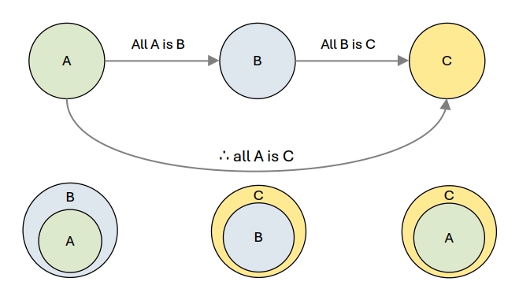

---

# Research and scientific methods<!--fit-->

<!-- footer: Research and scientific methods -->

---
### Epistemology<!--fit-->

 

> the theory of knowledge, especially with regard to its methods, validity, and scope, and the distinction between justified belief and opinion.

---
## Research and scientific methods
+ Research seeks knowledge through searching, investigation, or experimentation to discover and interpret new knowledge.
+ The *scientific method* is a systematic body of procedures and techniques applied in carrying investigation or experimentation to obtain new knowledge.

---
## Categories of research
+ The philosophical approach to research is of two types. 
  * _Empirical_
  *  _Theoretical_
* *Empirical* research is based upon *observation* and *experience* more than upon *theory* and *abstraction*.
* Empirical and theoretical research complement each other in developing an understanding of phenomena in predicting future events.
<!--
Epidemiological research, for example, depends upon the systematic collection of observations on the health-related phenomena of interest in defined populations.
-->

---
## Empirical
+ Empirical research in the health sciences can be *qualitative* or *quantitative* in nature.

---
## Scientific foundations of research

The fundamental principles include:

1) Order
2) Inference and chance
3) Evaluation of probability
4) Hypothesis

---
### Order
+ The scientific method uses an *organized observation* of entities or events classified or ordered based on common properties and behaviors to arrive at conclusions.
+ This systematic organization of properties and behaviors allows predictions, which, carried to the ultimate, become laws.

---
### Inference and chance
There are two distinct approaches in the development of inferences: 

1) _Deductive_
2) _Inductive_

---
### Deductive inference

+ The conclusion necessarily follows from the premises.
+ Syllogism: All A is B, All B is C; therefore, all A is C
+ Deduction moves *from the general to the specific* and does not allow for chance or uncertainty
+ Deductive inference is suited to theoretical research.

---
<!--  
_header: Figure: Deductive inference
_paginate: skip 
-->

---
### Inductive inference
+ Empirical research depends almost entirely upon inductive reasoning.
+ The conclusion does not necessarily follow from the premises or evidence (facts), i.e., there is a possibility that the premises may be true but the conclusions false.
+ So, must fully account for chance.
+ Inductive inference moves *from the specific to the general*.

---
## Evaluation of probability

+ Probability is a measure of the *uncertainty* or variability of the characteristic among individuals in the population.
  * If the entire population is observed, the relative frequencies of the variables provide all the information about the variability.
  * Since only a sample of individuals in the population is observed; the inference from the sample to the population (specific to general) will involve identifying the probabilities being observed.
  * The laws of probability allow us to measure the amount of *uncertainty* in our inferences.

---
> Probability is a critical requirement in research design to ensure validity - the proper design of research incorporates the laws of probability.

---
## Hypothesis
+ Hypotheses are carefully constructed statements about phenomena in the population.
+ Hypotheses may be generated by deductive reasoning or based on inductive reasoning from prior observations.
+ We cannot draw definitive conclusions or claim proof using the inductive method. 
+ Still, we can come ever closer to the truth by knocking down existing hypotheses and replacing them with ones of greater plausibility.

---
### Mill&lsquo;s canons
Mill’s canons of inductive reasoning are often used in forming hypotheses which related association and causation: 
1. Method of difference
2. Method of agreement
3. Method of concomitant variation
4. Method of analogy

---
### Method of difference
+ When a disease frequency is markedly dissimilar under two circumstances, and a factor can be identified in one circumstance and not in the other.
+ This factor or its absence may cause the disease.
 

> The difference in frequency of lung cancer in smokers and non-smokers.

---
### Method of agreement
+ When a factor or its absence is common to different circumstances that are associated with the presence of a disease
+ That factor or its absence may be causally associated with the disease.
  

> The occurrence of hepatitis A is associated with patient contact, crowding, and poor sanitation and hygiene, each conducive to the transmission of the hepatitis virus.

---
### Method of concomitant variation - the dose-response effect
> The increasing expression of endemic goitre with decreasing levels of iodine in the diet

> Increasing levels of leukaemia with increasing radiation exposure

> Increase in prevalence of elephantiasis in areas of increasing filarial endemicity

---
### Method of analogy
+ The distribution and frequency of a disease or effect may be similar enough to that of some other disease to suggest commonality in cause.
 

> Hepatitis B virus and cancer of the liver