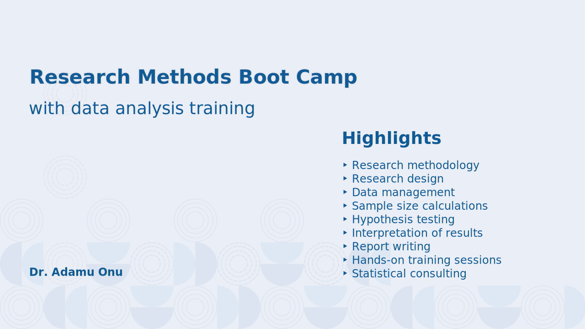

---

# Research strategies and research design<!--fit-->

<!-- footer: Research strategies and research design -->

---
## Introduction
+ The selection of a research strategy is the core of a research design. 
+ The research strategy is probably the single most important decision the investigator has to make.

---
## Key steps in the research process

+ Successful research can be characterized by a series of well-defined steps.
+ Research questions can demand rather complex and intense investigation efforts.

> Why do people consume large amounts of saturated fats despite widespread awareness that these fats cause heart disease?

---
## Key steps in the research process

+ An investigator could pursue:
  * Cognitive reasons &rArr; _&ldquo;those foods really taste good&rdquo;* or *&ldquo;those foods are satisfying&ldquo;_
  * Social reasons &rArr; _&ldquo;most party foods are not healthy, but having fun is more important&rdquo;_
  * Cultural reasons &rArr; _&ldquo;those foods are a tradition in our house&rdquo;_
  * Economic reasons &rArr; _&ldquo;fatty foods are usually more filling and less expensive than healthy foods&rdquo;_
  * _Perceived vulnerability_ of the study participants to diseases associated with a diet high in saturated fats

---
## Key steps in the research process
+ Thus the seemingly humble research question is actually an entire research career. 
+ Successful researchers devote themselves to one or two areas of inquiry. 
+ The focus enables them to use the findings from one study as the platform to formulate subsequent research questions for the next study and so on.

---
## The Nine-Step Model

1) Defining the research population
2) Defining the research goal and specifying the exact research questions
3) Determining whether the research should be observational or experimental
4) Selecting a research design that provides a rigorous test of the research questions
5) Determining the variables that must be measured
6) Selecting the sampling procedure
7) Implementing the research plan
8) Analyzing the data
9) Disseminating the findings

---
## Step 1: Define the research population

+ Population is a broad term that can be defined in many different ways.
+ The researcher needs to specify the parameters that will describe the target population.
+ Defining the target population is not an arbitrary process. 
+ Selecting the population should be based on known epidemiology of the disease or health risk behaviour under consideration.

> For example, &ldquo;low-income youths, aged thirteen to nineteen years of age, residing in rural, tobacco-producing states.&rdquo;

---
## Step 2: Define the research goal and specify the exact research questions
+ Narrow and precisely defined goals and questions are more amenable to rigorous research designs than broadly defined goals and questions.
+ Thoroughly review the recent and relevant literature to avoid this pitfall.
  + Usually restricted to the past five years
  + Should include articles directly related to the topic, and those related tangentially
  + Assign higher priority to directly related articles

---
## Step 2: Define the research goal and specify the exact research questions
+ The research goal is a general statement that conveys the purpose of the planned study.
+ The goal provides an overview of purpose and scope, but it lacks precision and specificity

> To determine the efficacy of providing behavioural interventions for youths who have recently begun to use tobacco

---
## Step 2: Define the research goal and specify the exact research questions

The **research question** provides the precision and the specificity.

+ Research questions are based on the research goal.
+ Each question is a derivative of the overarching research goal and should provide information that serves the research goal

---
### Examples of research questions

> Will a twelve-hour small-group intervention promote tobacco cessation among a greater percentage of youths than a brief version (six hours) of the same program?

> Will a twelve-hour small-group intervention promote tobacco cessation among a greater percentage of youths as compared to youths who receive no program at all?

---
## Step 3: Determine whether the research should be observational or experimental

### Observational research
  * Variables are observed as they exist in nature.
  * No manipulation of variables occurs. Does not involve treatment or intervention
  * Ask questions pertaining to &ldquo;why people do what they do?&rdquo;

---
## Step 3: Determine whether the research should be observational or experimental

### Experimental research
  * Involves _manipulation_ of a variable
  * Builds upon observational research by asking &ldquo;How can we help people achieve positive change?&rdquo;
  * Concerned with the question of whether a given intervention can produce outcomes of statistical significance and, more important, practical (or clinical) significance.

---
## Step 4: Select a research design that provides a rigorous test of the research questions

+ The choice of research design may range from simple observational studies to complex experimental studies.
+ _**Parsimony**_ implies that the need (i.e. investigating the research question) is met by a tool (i.e., the research design) that does the job well, without going beyond that which is necessary
+ Parsimony is the guiding principle in selecting a research design. 

---
## Step 4: Select a research design that provides a rigorous test of the research questions

### Observational research

+ Qualitative research
+ Cross-sectional surveys
+ Cohort studies

---
## Step 4: Select a research design Tthat provides a rigorous test of the research questions

### Experimental research

+ Pre-experimental studies (lack of randomly assigned controls)
+ True experimental studies (randomly assigned controls)

### Quasi-experimental studies
+ A group is purposely selected for comparison)

---
## Step 5: Determine the variables that must be Measured

+ A variable is anything that changes, meaning it must assume a range of values.
+ Every variable required for a rigorous study must be identified
+ The way in which the variables are measured is important. Rigour is dependent on the selection of reliable and valid measurement instruments.
+ Some variables may be measured directly using physical instruments, or by observation.
+ Some variables may be measured indirectly using participants’ self-reports.

---
## Step 6: Select the sampling procedure
+ There are numerous sampling procedures that can be used.
+ The sampling procedure is <u>one of the most critical</u> determinants of **external validity**

---
### External validity
+ The ability to generalize study findings to the population of individuals with similar characteristics represented in the study sample.
+ Not all research studies need to use a sampling procedure that yields high external validity

---

<!-- 
_header: Figure: External validity
_paginate: skip
-->

---
## Step 6: Select the sampling procedure
+ **Sampling** includes specifying the number of study participants
+ This number (sample size) is selected based on a power analysis.
+ A power analysis is the estimated *ability of a statistical test to find true differences between variables or between groups* of study participants.
+ Sampling is one of the most important determinants of the study's power.

---
## Step 7: Implement the research plan
+ **Internal validity** requires that all study **protocols** must be implemented *consistently*
+ Internal validity implies that the study is not confounded by design, measurement, or poor implementation of study procedures.

---
## Step 8: Analyse the data
+ Once all assessments are concluded, a data set can be established
+ The data set consists of all the variables measured for each participant and is used to answer the research questions formulated in Step 2.
+ After the data is checked for logical inconsistencies, the research process becomes dependent on the researcher's statistical skill.
+ The principle of parsimony is applicable here
  + The goal is not to perform sophisticated analysis.
  + The goal is to perform an analysis that provides a rigorous and fair test of the research question

---
## Step 9: Disseminate the findings
+ Rigorous research warrants widespread dissemination
+ This elevates the project from a work in progress to science
+ The rudimentary starting point of this process is transforming the analytic results (numbers) into carefully articulated findings.
+ Findings are answers to the research questions that are generated by the data analysis.

---
## Step 9: Disseminate the findings
+ The findings must be considered within the context of related research:
  + How the findings strengthen or extend previous work
  + Nonsignificant findings (*if the study has a high degree of rigour*) can be just as important as significant findings with respect to building the research base

---
## Step 9: Disseminate the findings
+ Findings may raise additional questions that bring the research process back to its origins.
  + Research is an **iterative** process
  + Every time a research question is asked and answered another question (or set of questions) becomes apparent.

---
## Step 9: Disseminate the findings
+ Once the researcher has successfully answered the research question, the remaining task is to prepare written and visual (i.e., tables and figures of study results) summaries of the research process (steps 1 through 8)
+ It is a historical account of the rationale underlying the research questions and the protocols used to answer these questions
+ Written and visual records can be disseminated through multiple channels

---
## Summary
+ Provided a thumbnail sketch of the research process
+ This sketch can be used as a platform to gain competence and proficiency in each of the nine steps described
+ The rest of this course is devoted to expanding this thumbnail sketch into a more complete masterclass of health research methods

<!--
## Applied Example

Hagan H, Thiede H, Weiss NS, Hopkins SG, Duchin JS, Alexander ER. Sharing of drug preparation equipment as a risk factor for hepatitis C. Am J Public Health. 2001 Jan;91(1):42-6. doi: 10.2105/ajph.91.1.42. PMID: 11189822; PMCID: PMC1446500.

+ This study provides an illustration of the nine-step model.
+ Identify each step of the nine-step model in this journal article
-->

---
## Practice and Discussion
1. Think about your proposed research topic or study
2. Identify your study population (step 1)
3. Develop a single but important research question (step 2)
4. Having resolved steps 1 and 2, begin to think about the planning phase of your study.
5. Thus you consider steps 4, 5, and 6.

> Please think through each of these steps carefully and create a rigorous plan to investigate your research question.