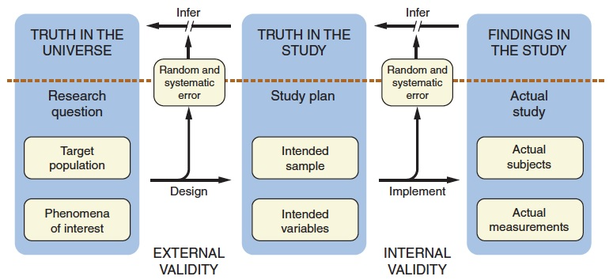
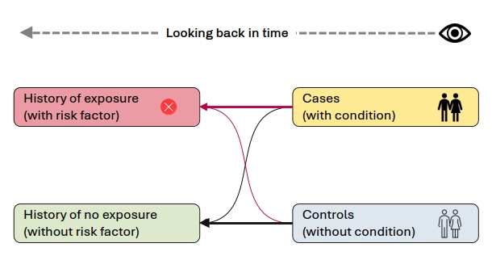

---

# Types of research designs<!--fit-->

---
<!-- footer: "Type of research designs" -->

## Choosing a research design

> The research design of a study is the strategy the investigator chooses for answering the research question.

---
<!--
_header: Figure: External validity
_paginate: skip
-->

---
## Choosing a research design

+ Factors that play a role in deciding the type of research design:
  * The research question
  * Ethical issues
  * Cost
  * Feasibility
  * Access to the study population
* Each design has strengths and limitations which determine the conclusions that may be drawn from the research.
* Choosing the most appropriate study design is critical to success

---
## Stages of the research process
+ Research can be conceptualized as an interlocking chain - with each link being the precursor of the next.
+ The first link is *exploratory research*.
+ The subsequent links are varying levels of *conclusive research*

---
## Exploratory research

+ Exploratory research generates specific research questions and serves as the basis for future conclusive research. 
+ Exploratory research *describes* the issue.

---
### Examples

> What are the factors contributing to obesity among toddlers?

> Does intimate partner violence affect HIV risk?

> Is intimate partner violence related to women's health-seeking behaviors?”

---
## Conclusive research
+ Conclusive research provides information that is useful for reaching conclusions or in making decisions.
+ It has five overarching purposes
  1) To document the scope of the issue
  2) To test causal or etiological theories
  3) To identify the sequelae of disease or health conditions
  4) To evaluate measurement instruments
  5) To evaluate treatments or interventions

---
### Examples

> How many new cases of HIV infection occurred among men who have sex with men (MSM)?

> What are the long-term side effects of highly active antiretroviral therapy?

> What are the psychological and psychosocial effects of HIV diagnosis among adolescents?

---
## Conclusive research

+ Conclusive research has clearly defined research questions. Findings inform *hypothesis testing* and decision making

---
## Exploratory and conclusive research

+ Both exploratory and conclusive research can be further subdivided into:
  1) _Descriptive_ research, and 
  2) _Causal_ research

---
## Descriptive research

+ Descriptive research provides data describing
  * &ldquo;Who&rdquo;
  * &ldquo;What&rdquo;
  * &ldquo;When&rdquo;
  * &ldquo;Where&rdquo; 
  * &ldquo;How”&rdquo;
+ Descriptive research uses <u>observational designs</u> to achieve its objectives.

---
## Observational research design
+ Observational research designs refer to research in which variables are observed as they exist in nature - no manipulation of variables occurs.
+ Can involve both *qualitative* and *quantitative* methods
+ It is the manner in which you collect the data and *not* the statistical technique that allows one to make causal inferences.

---
## Qualitative research design
+ Qualitative methods do use specific research designs.
+ Depending on the research question, different strategies are used (*phenomenology*, *ethnography*, *grounded theory*).
  1) The data consists of observations that do not take the form of numbers.
  2) The data consists of verbal responses to structured or semistructured questions which may be audiotaped and then transcribed.
  3) Analysis is by reviewing the transcriptions and identifying themes that emerge.
  4) Results are conveyed through description.

---
## Quantitative research design 
+ The nature of quantitative data involves numerical values.
+ Verbal or written responses are quantified by transforming them into numerical values.
+ Analysis of quantitative methods requires the use of statistical procedures.
<!--
+ Quantitative methods use 
  + cross-sectional designs,
  + successive independent samples design, and 
  + longitudinal designs.
-->

---
## Kinds of descriptive studies
### Case series
+ Based on reports of a series of cases of a specific condition, or a series of treated cases, with no specifically allocated control group.

### Community diagnosis or needs assessment
+ Entails collection of data on existing health problems, programmes, achievements, constraints, social stratification, leadership patterns, focal points of resistance or high prevalence, or groups at highest risk.

---
## Kinds of descriptive studies
### Epidemiological description of disease occurrence
+ Entails collection of data on the occurrence and distribution of disease in populations according to specific characteristics of individuals, place and time.

---
## Kinds of descriptive studies
### Descriptive cross-sectional studies or population surveys
+ Ccollect data on a cross-section of the population, which may comprise the whole population or a proportion (sample) of it. 
+ Does not aim at testing a hypothesis about an association. 
+ They provide a prevalence rate at a particular point in time (point prevalence) or over a period of time (period prevalence).
+ The study population at risk is the denominator for these prevalence rates.

---
## Kinds of descriptive studies
### Ecological descriptive studies
+ When the unit of observation is an aggregate (e.g. family, clan
or school) or an ecological unit (a village, town or country) the study becomes an ecological descriptive study.

---
<!--
_paginate: skip
-->

## Analytical strategies in epidemiology
+ Observational studies, where establishing a relationship (association) between a &lsquo;risk factor&rsquo; and an outcome (disease) is the primary goal, are termed analytical. 
+ Hypothesis testing is the primary tool of inference. 
+ The basic approach in analytical studies is to develop a specific, testable hypothesis, and to design the study to control any extraneous variables that could potentially confound the observed relationship between the studied factor and the disease. The approach varies according to the specific strategy used.

---
## Kinds of descriptive studies
### Case-control designs

+ Simplest and most commonly used analytical strategy.
+ Designed primarily to establish the causes of diseases by investigating associations between exposure to a risk factor and the occurrence of disease. 
+ It is backward-looking (retrospective) based on the exposure histories of cases and controls. 

---
## Kinds of descriptive studies
### Case-control designs

+ One investigates an association by contrasting the exposure of a series of cases of the specified disease with the exposure pattern of carefully selected control groups free from that particular disease. 
+ Data are analysed to determine whether exposure was different for cases and for controls. The risk factor is something that happened or began in the past, presumably before disease onset. 
+ Information about the exposure is obtained by taking a history and/or from records.

---
<!-- 
_header: Figure: Case-control design 
_paginate: skip
-->

---
### Selection of cases
+ The selection of cases should be such that the study results are reliable and valid:
  1. Clearly defined inclusion and exclusion criteria
  2. If the number of cases is too large, a probability sample may be used
  3. Cases selected for the study should be representative of all cases of the disease under consideration.

---
### Selection of cases
#### Sources of cases:
  - All cases admitted to or discharged from a hospital, clinic, or private practice within a specified period
  - All cases reported or diagnosed during a survey or surveillance programme within a specified period
  - Incident or newly diagnosed cases
  - Incident cases in an ongoing cohort study or in an occupational cohort (sometimes called a nested case-control study)
  - Deaths with a record of causes of death, fulfilling other study criteria
  - Case units with a prescribed health outcome

---
### Selection of controls
+ The most important aspect of the case-control study, as biases in the selection of controls may invalidate the study results.

---
### Selection of controls
#### Sources of comparison groups:
+ a probability sample of a defined population, if cases are drawn from that defined population
+ a sample of patients in the same institution as the cases
+ a sample of relatives or associates of the cases
+ a group of persons selected from the same source population as the cases, and matched with the cases for potentially confounding variables

---
### Advantages of case-control studies
+ When the disease being studied occurs only rarely
+ Relatively efficient, requiring a smaller sample than a cohort study
+ Little problem with attrition
+ Sometimes they are the earliest practical observational strategy for determining an association, e.g. in an outbreak investigation

---

### Disadvantages and biases of case-control studies

+ Calculation of incidence rates, and hence of attributable risks, impossible.
+ Temporality is a serious problem in many case-control studies as it is not possible to determine whether the attribute led to the disease/condition, or vice versa.

---

## Prospective cohort studies

+ Cohort studies start with a representative sample of the reference population: 
  + some of whom have certain characteristics or attributes relevant to the study (exposed group), with 
  + others who do not have those characteristics (unexposed group).
+ Both groups should, at the outset of the study, be free from the condition or conditions under consideration. 
+ Both groups are then observed over a specified period to find out the risk each group has of developing the condition(s) of interest.

---
<!-- _header: Prospective cohort studies -->

---

# Prospective cohort studies

Can measure the incidence of disease

## Cumulative incidence (incidence proportion)

$$\frac{\text{\textsf{number of new cases or events in a specified period}}}{\text{\textsf{total population at risk during that period}}}$$

## Incidence density
+ Takes into consideration both the number observed and the person-time experienced.

$$\frac{\text{\textsf{number of new cases or events in a specified period}}}{\text{\textsf{total time experienced by subjects followed}}}$$

---
<!-- _header: Cummulative incidence vs. incidence density -->

---
## Advantages of cohort studies
+ Allows the direct measurement of the relative risk.
+ Can demonstrate temporality, allowing for a conclusion of cause-effect relationship (a necessary, but not sufficient, condition).
+ Less likelihood of recall bias.
+ Can estimate attributable risks, thus indicating the absolute magnitude of disease attributable to the risk factor.
+ If a probability sample is taken from the reference population, it is possible to generalize from the sample to the reference population with a known degree of precision.

---
## Disadvantages of cohort studies
+ These studies are long-term and are thus not always feasible
+ They are relatively inefficient for studying rare conditions.
+ They are very costly in time, personnel, space and patient follow-up.
+ Sample sizes required for cohort studies are extremely large, especially for infrequent conditions.
+ The most serious problem is that of attrition, or loss of people during the course of the study.
+ There may also be attrition among investigators.

---
## Disadvantages of cohort studies
+ Over a long period, many changes may occur in the environment, among individuals or in the type of intervention, and these may confuse the issue of association and attributable risk.
+ Over a long period, study procedures may influence the behaviour of the persons investigated in such a way that the development of the disease may be influenced accordingly (Hawthorne effect). 

---
# Analytical cross-sectional studies
+ Data are collected at the same time on the risk factor or characteristic and the condition. 
+ By taking a representative sample, it is possible to generalize the results obtained in the sample for the population as a whole. 
+ Cross-sectional studies measure the association between the exposure variable and existing disease (prevalence).

---

<!-- _header: Cross-sectional design -->

---
## Advantages of cross-sectional studies
+ Cross-sectional studies have the great advantage over case-control studies of starting with a reference population from which the cases and controls are drawn.
+ They can be short-term, and therefore less costly than prospective studies.
+ They are the starting point in prospective cohort studies for screening out already existing conditions.
+ They provide a wealth of data that can be of great use in health systems research.
+ They allow a risk statement to be made, although this is not precise.

---
## Disadvantages of cross-sectional studies:
+ They provide no direct estimate of risk.
+ They are prone to bias from selective survival.
+ Since exposure and disease are measured at the same point in time, it is not possible to establish temporality (i.e. whether the exposure or presence of a characteristic preceded the development of the disease or condition).

---
# Ecological studies
+ The unit of observation is an aggregate, a geographical administrative locality, a cluster of houses, a town, a whole country, etc.
  + Aggregate analysis of national figures
  + Time-series ecological studies

---
## Disadvantages and biases in ecological studies
+ They cannot be used as the basis for making causal inference. 
+ Their most serious flaw is the risk of **ecological fallacy**, when the characteristics of the geographical unit are incorrectly attributed to the individuals. 
+ Other sources of confounding are possible since many risk factors have a tendency to cluster in certain geographic areas.

---
# Cohort-sequential design
+ This is essentially a hybrid of cross-sectional and longitudinal designs.
+ Starting with an initial cohort and following it over a period of time, another cohort or cohorts are then added at varying intervals within the time period.
+ Changes over time for the first cohort can be assessed while also being able to make cross-sectional comparisons among the different cohorts at specific time points.

---
# Causal Research
+ Causal research assesses what *caused* the health issue.
+ Causal research employs *experimental designs* (sometimes quasi-experimental designs) so that causal inference can be made with a high degree of certainty.
+ Experimental designs entail the manipulation of a variable to test the effects of the manipulation on some outcome.
+ Quasi-experimental designs approximate experimental designs but do not use *randomization*.

---

> Causal research allows us to predict, understand, control behavior, and change behavior.

---
# Experimental designs
+ The two main defining characteristics of experimental designs
  1) **Manipulation** of an *independent* variable
  2) **Control** over *extraneous* variables

---

---
## Independent variable
+ The independent variable is the variable chosen by the investigator to determine its effect on the *dependent* variable and is manipulated or controlled by the investigator.
  + If the investigator is manipulating only one factor, then the design is a single-factor design
  + If more than one factor, it is a factorial design.
  + The number of independent variables equates with the number of factors in the design

---
## Dependent variable
+ The dependent variable is the outcome variable of interest and is measured by the investigator.

---
## Extraneous variables
+ Extraneous variables are not directly related to the hypothesis being tested, but may have an effect on the dependent variable.
  + The effects of extraneous variables are controlled by holding them constant or by randomization.
  + Extraneous variables can threaten the *internal validity* of the study by providing alternative explanations or rival hypotheses.

---
# Internal Validity
+ This the ability of the design to test the hypothesis it was designed to test.
+ This is the approximate **truth** about inferences regarding cause-effect relationships.
+ Threats to internal validity must be addressed prior to conducting your study so that alternative hypotheses can be ruled out

---
## Threats to internal validity
+ Seven common threats to validity need to be considered when designing your study:
  1) History
  2) Maturation
  3) Testing
  4) Instrumentation
  5) Statistical regression
  6) Selection bias
  7) Mortality

---
## 1. History

+ Results might be due to an event that occurred between observations.

---
## 2. Maturation

+ Results might be due to participants growing older, wiser, stronger or more experienced between observations.

---
## 3. Testing

+ Results might be due to the number of times responses are measured

---
## 4. Instrumentation

+ Results might be due to change in the measuring instrument between observations.

---
## 5. Statistical regression

+ Results might be due to the selection of participants based on extreme scores, and when measured again, scores move back to an average level.

---
## 6. Selection bias

+ Results might be due to differences that existed between participants in groups before treatment occurred.

---
## 7. Mortality

+ Results might be due to the differential loss of participants from groups.

---
## Error variance
+ This is the variability in the dependent variable that cannot be attributed to the independent variable, but rather is due to the extraneous variables or to variability among human subjects
  * Error variance may affect the ability to attribute observable effects to the manipulation of the independent variable
  * Different types of designs handle error variance differently
  * Should be a consideration when choosing an appropriate design.

---
# Experimental Research Design
A true experimental design must include more than one group, common measured outcome(s), and *random* assignment.
+ Between-subjects design
+ Matched groups design
+ Within-subjects design or repeated-measures design

---
## Between-subjects design
+ Different groups or arms (a group of participants in a clinical trial all of whom receive the same treatment) are exposed to different levels of the independent variable
+ A randomized between-subjects design that uses random assignment is the randomized controlled trial.
+ The number of levels of the independent variable dictates the number of arms to be employed in an RCT

---
## Matched groups design
+ This design is used when a particular subject characteristic is strongly associated with the dependent variable.
+ *Randomization* may lead to the characteristic not being equally distributed between groups.
+ To ensure equal distribution, subjects are matched on the characteristic prior to random assignment.
+ Use of this design often involves the site versus individual subjects as the unit of assignment (school, community, workplace, etc)

---
## Within-subjects design or repeated-measures design
+ Effective in reducing error variance due to human subject differences
+ The same subjects are exposed to different levels of the independent variable.
+ The same subjects form the different groups for comparisons.
+ This is not a true experimental design because it does not have random assignment.
+ Rarely used because of carryover effects (learning, fatigue, habituation, sensitization, and adaptation)
+ An adaptation of this design is the cross-over trial.

---
# Quasi-Experimental Designs
+ Similar to true experiments in that there is a treatment of some kind and there are outcome measures.
+ The main difference is that quasi-experiments *do not use random assignment* to create groups necessary for comparison.
+ Random assignment may not be possible because of not being feasible, ethical, or legal.

---
+ **Quasi-experimental designs** are considered causal research but the ability to rule out alternative explanations is much more limited than when using an experimental design.
  + Nonequivalent control group design
  + Interrupted time-series design

---
## Nonequivalent control group design
+ A group is matched as closely as possible to the experimental group and used as a comparison group.
  + Nonequivalent group, posttest-only design
  + Nonequivalent group, pretest-posttest design

---
### Nonequivalent group, posttest-only design
+ Consists of administering an outcome measure to a treatment group and a comparison group
+ At the end of the time period, a test is administered to see which treatment is more effective.
+ The groups might not be the same before the intervention starts

---
### Nonequivalent group, pretest-posttest design
+ Improves on the limitation of the nonequivalent group, posttest-only design.
+ Allows the researcher to empirically assess differences in the groups prior to implementation of the intervention.
+ The researcher could potentially control for differences statistically.

---
## Interrupted time-series design
+ Strongest quasi-experimental approach for evaluating the longitudinal effects of interventions
+ Involves collecting data at multiple instances over time before and after treatment of some kind.
+ A treatment effect is demonstrated if the pattern of posttreatment responses differs significantly from the pattern of pretreatment responses.

---
+ **Simple interrupted time series**
  + Has only one experimental group.
+ **Interrupted time series with nonequivalent control group**
  + Adds a nonequivalent control group.

---
# Integration With the Research Process
+ Choosing an appropriate research design is a critical part of the overall research process and may depend to a large degree on the nature of the research question.
+ Once an appropriate research design is selected, this defines the appropriate statistical technique to be employed for data analysis.

---
# Summary
+ All of the designs described have associated strengths, limitations, and varying levels of rigor.
+ It is important to know the strengths and limitations of each research design and how this may affect the study results and the interpretation of those results.
+ The most important decision is the selection of a research design.

---
# Practice and Discussion
1. Thinking about your proposed research topic, which research design would be best suited to answering your research question?
2. For each research goal listed below, indicate the best research design that could be applied most effectively to address the goal

---

> To determine the efficacy of a three-session intervention program designed to promote the consumption of a diet low in saturated fats among cardiac rehabilitation patients.

---

> To test the hypothesis that childhood activity levels predict obesity in early adulthood.

---

> To determine the relationship of sleep to depression in college students.

---

> To explore the role of self-efficacy in the decision to enroll in a smoking cessation course.